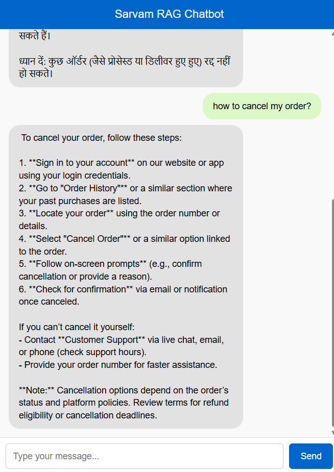
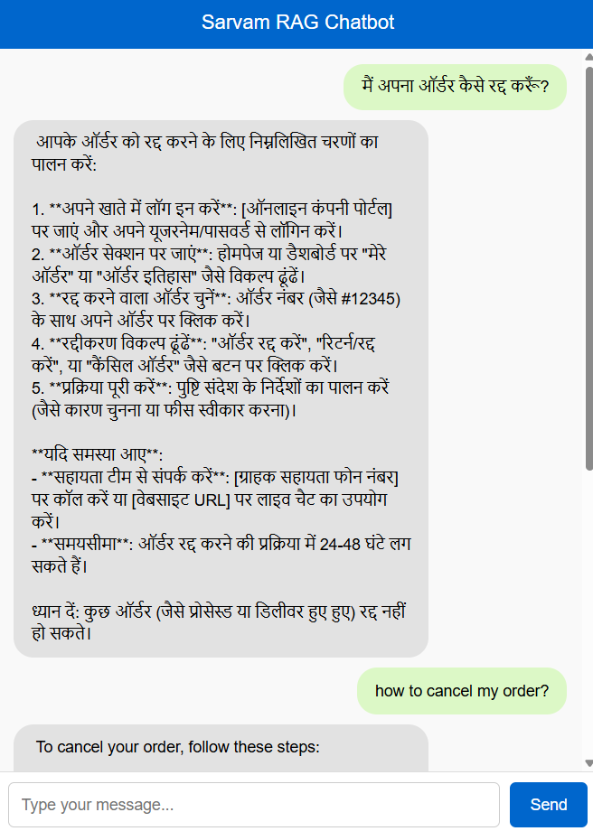
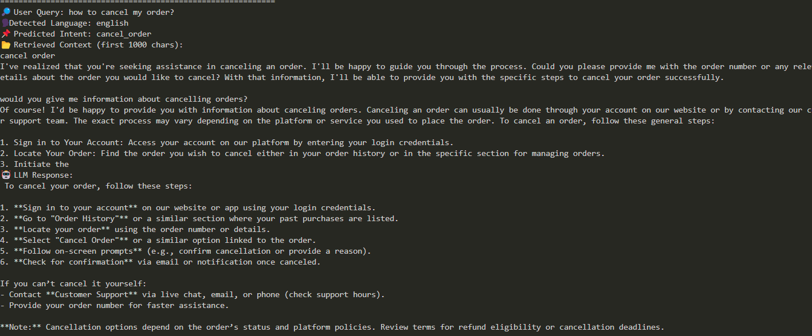
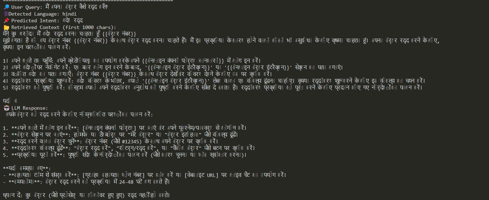

# Multilingual RAG Chatbot for Customer Support 🌍💬

---

## Project Overview

This project develops a **multilingual Retrieval Augmented Generation (RAG) chatbot** specifically tailored for **customer support**. The chatbot is designed to provide comprehensive support by leveraging advanced AI models and a robust vector database. A key feature is its ability to handle queries in multiple languages, currently supporting **English** and **Hindi**, making it highly versatile for diverse user bases. It integrates **Sarvam AI LLM** for powerful language understanding and generation, combined with **Pinecone Vector Database** for efficient information retrieval.

---

## Features

* **Multilingual Support**: Seamlessly interacts with users in both English and Hindi.
* **Retrieval Augmented Generation (RAG)**: Combines the power of large language models with a retrieval mechanism to provide accurate and contextually relevant responses.
* **Customer Support Focus**: Built to address common customer inquiries and provide instant assistance.
* **Scalable Knowledge Base**: Utilizes Pinecone for efficient storage and retrieval of vast amounts of information.
* **Pre-trained Models**: Includes pre-trained logistic regression models for language-specific intent classification.

---
## Screenshots

Here you can add screenshots of the chatbot in action. This helps users quickly understand the UI and functionality.

| Chat Interface (English) | Chat Interface (Hindi) |
| :----------------------- | :--------------------- |
|  |  |
| *Example of an English interaction* | *Example of a Hindi interaction* |

| Terminal (English) | Terminal (Hindi) |
| :----------------------- | :--------------------- |
|  |  |
| *Example of an English interaction* | *Example of a Hindi interaction* |
---

## Technologies Used

* **Python**: The primary programming language used for development.
* **Jupyter Notebook**: Used for data preprocessing, model training, and experimentation (`Chatbot_PreProcess.ipynb`).
* **Sarvam AI LLM**: The Large Language Model powering the generation capabilities.
* **Pinecone Vector Database**: For storing and retrieving vector embeddings of customer support data.
* **Scikit-learn**: For machine learning tasks, including logistic regression models and vectorizers.
* **Streamlit / Flask (Inferred from `app.py`)**: Likely used for the chatbot's web interface.
* **Pandas**: For data manipulation and processing (`english_dataset.csv`, `hindi_dataset.csv`).
* **HTML / CSS**: For front-end presentation, as indicated by repository analysis.

---

## Getting Started

Follow these steps to set up and run the multilingual RAG chatbot.

### Prerequisites

* Python 3.x
* Pip (Python package installer)
* Access to a Pinecone account and API key.
* Sarvam AI LLM API access.

### Installation

1.  **Clone the repository:**
    ```bash
    git clone [https://github.com/Shaun-Roy/MULTILINGUAL-RAG-CHATBOT-CUSTOMER-SUPPORT.git](https://github.com/Shaun-Roy/MULTILINGUAL-RAG-CHATBOT-CUSTOMER-SUPPORT.git)
    cd MULTILINGUAL-RAG-CHATBOT-CUSTOMER-SUPPORT
    ```

2.  **Create a virtual environment (recommended):**
    ```bash
    python -m venv venv
    source venv/bin/activate  # On Windows use `venv\Scripts\activate`
    ```

3.  **Install the required dependencies:**
    *(Note: A `requirements.txt` file is not explicitly in the repo, but common libraries can be inferred.)*
    ```bash
    pip install pandas scikit-learn pinecone-client streamlit # Add other necessary libraries like Sarvam AI client if available via pip
    ```
    *You may need to install specific libraries for Sarvam AI LLM if they are not included above.*

### Pinecone Setup

1.  **Configure Pinecone API:**
    Set your Pinecone API key and environment variables. Refer to `pinecone_uplaod.py` for how these are used.
    ```python
    # Example in pinecone_uplaod.py or similar setup
    # pinecone.init(api_key="YOUR_API_KEY", environment="YOUR_ENVIRONMENT")
    ```

2.  **Upload Data to Pinecone:**
    Run the `pinecone_uplaod.py` script to upload your English and Hindi datasets into the Pinecone vector database. Ensure your datasets (`english_dataset.csv`, `hindi_dataset.csv`) are correctly formatted.
    ```bash
    python pinecone_uplaod.py
    ```

---

## Usage

1.  **Data Preprocessing and Model Training (if needed):**
    The `Chatbot_PreProcess.ipynb` Jupyter Notebook handles data cleaning, embedding generation, and training of the logistic regression models. Run through this notebook if you need to re-process data or retrain models. Pre-trained models (`logreg_model_english.pkl`, `logreg_model_hindi.pkl`) are provided.

2.  **Run the Chatbot Application:**
    The main application interface is likely powered by `app.py`.
    ```bash
    streamlit run app.py # Or python app.py if it's a Flask app
    ```
    Open your web browser and navigate to the address provided by Streamlit (usually `http://localhost:8501`).

3.  **Interact with the Chatbot:**
    You can now interact with the multilingual chatbot by typing your queries in either English or Hindi.

---
